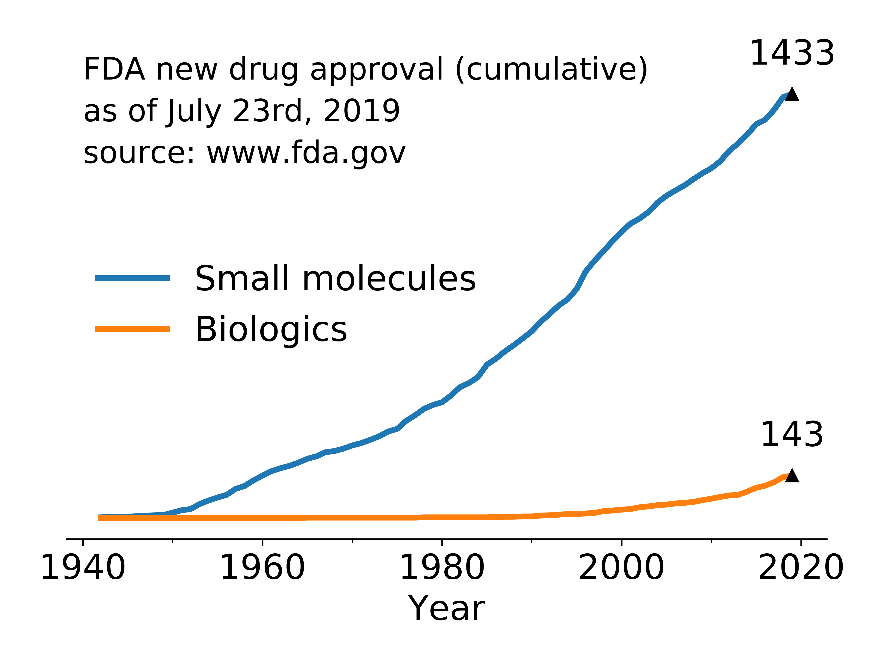

# FDA_drug_approval
Provide an example visualization of drug approvals by FDA.



## Python script
### ```parse_all_products.py```
Parse tables in ```drugsatfda20190723.zip``` and obtain a table of approved products.
### ```parse_biologics.py```
Parse the list of biologics and obtain a table of approved biologics.
### ```visualize.py```
Simple example visualization.

## Data source
### Approved products
* Source name: FDA website
* Source URL: [link](https://www.fda.gov/drugs/drug-approvals-and-databases/drugsfda-data-files)
* Retrieval date: July 28th, 2019, at 20:10
* Raw data file name: ```drugsatfda20190723.zip```
### List of biologics
* Source name: FDA website
* Source URL: [link](https://www.fda.gov/media/89589/download)
* Retrieval date: July 28th, 2019, at 22:46
* Raw data file name: ```CDER List of Licensed Biological Products 7-23-2019_.pdf```
* Manual processing: (1) Copied the table in the PDF file to Google Sheets ([link](https://docs.google.com/spreadsheets/d/1pHdim27oVzHEALzkGRbS4-_s4RKA4HnV-e3SHrWPRV8/edit#gid=0)). (2) Downloaded Google Sheets as a CSV file ```fda_biologics_list.csv```.

## Note
* Target disease of a drug
Target disease of a product is not tabulated, but appears in the application documents. ```ApplicationDocs.txt``` contains URL to the application documents with application number as the key. However, documents are PDF files of letters written in natural language (English).
* Drug modality
It's hard to systematically classify "small molecules" and "biologics" solely based on the active ingredients. Also, the border gets blurred for drugs like polypeptides.

## Reference
### Submission status code
* Source: [link](https://www.fda.gov/media/95860/download)
* Description: AP = Approval, TA = Tentative Approval, CR = Complete Response, ECD = Easily Correctible Deficiency, IR = Information Request.
### Submission type code
* Source: [link](https://www.accessdata.fda.gov/scripts/cder/daf/index.cfm?event=glossary.page)
* Description: ORIG = new drug applications, SUPPL = change to an FDA approved application.
### Submission class code ID
* Source: ```SubmissionClass_Lookup.txt``` (can be found in ```drugsatfda20190723.zip```)
* Description: 7 = New Molecular Entity, 8 = New Molecular Entity and New Combination.
### Regular expression pattern for extracting brand name
* Source: [link](https://stackoverflow.com/questions/20225536/regular-expression-to-get-words-that-begin-with-a-capital-letter?rq=1)
* Description: all words starting with a capital letter.
